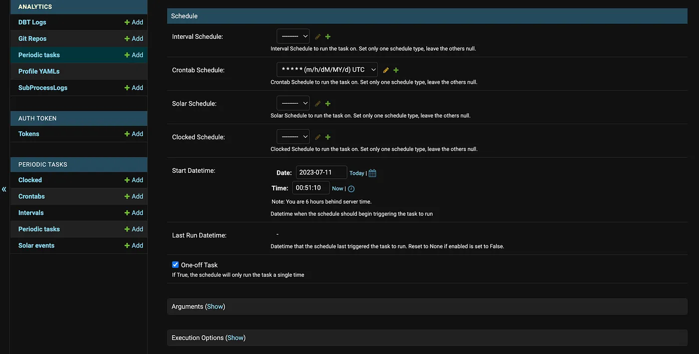

# django-build-tool: An Open Source Orchestration Tool for dbt Core

## Introduction

Since its release over 7 years ago dbt Core has become a staple in many companies data platforms. Since it is an open source tool, there are quite a few options for deploying jobs in production. Over the past 4 years I have used dbt a lot and have seen it deployed in many different ways. Despite seeing many creative deployment methods, I have always felt like there was not a great tool for deploying dbt projects easily and for a low cost. Airflow can be complicated and you will incur tech debt to build and maintain the code, dbt Cloud is expensive and does not always perform well, and all of the custom solutions I have seen run the risk of being complicated, expensive or unreliable. Despite dbt Core being such a great and powerful modeling tool, I have struggled to decide what the best and most cost effective way is to manage a project. I always felt like there should be a better option for deploying and running a project in the cloud for a low cost. I wished that there was an open source orchestration tool for executing dbt Core jobs that I could use without all the work that comes with Airflow. After gathering feedback from other engineers that use dbt Core and have similar experiences, I decided to build one. After successfully using it for a while I have decided to release it for free for anyone else who may resonate with the pain points I have written about.

## Background

As we all know dbt Core is an open source tool, but the open source components are not enough to manage a project in production. Dbt Core is just a simple CLI, it does not include a lot of the components that you need to manage a project. Components like a scheduler, metadata database, REST API, or any other infrastructure. Since it is just a CLI, dbt Core also does not take a lot of computing power to run; most of the heavy lifting is done by the data warehouse while dbt Core is simply waiting for a response. When taking these points into consideration it is hard to justify the prices that some commercial SaaS solutions charge. It is also important to consider that the amount you pay to actually execute jobs is only a small fraction of the total cost you are paying to use this transformation method; the majority of the cost will be on the data warehouse bill. It remains debatable how much money you should spend to transform your data, but it is clear that the cost to simply run the jobs should be kept as low as possible.

While there are some other open source platforms that can be used to cut costs like Airflow, they are not setup to run dbt out of the box and there is some coding and configuration needed. Beyond that, custom builds can range in cost and complexity.

All of this has lead to some ambiguity; there is not one objectively correct way that dbt Core must be managed to be successful, and a lot of companies are grossly overpaying to use it. Despite working with companies managing dbt in a number of ways, all of the solutions have had some negatives and I always felt like there should be a better option. I wanted an option with low complexity that also came at a low cost. For these reason I decided to build django-build-tool with the goal of creating an orchestrator for dbt Core that was easy to use and was available at a low (or no) cost.

### What is django-build-tool?

Django-build-tool is an open source orchestration tool that is designed specifically for executing dbt Core jobs. It is built using open source components and is available to use free of charge. You can use it locally, in the cloud or on-premise to orchestrate and run dbt jobs. It is built on open source components; the scheduler and API are built using Django, Celery and Redis, the metadata is stored in PostgreSQL, and the entire project is containerized using docker-compose.

### Why use it?

Django-build-tool has a lot of features that make it an attractive option for managing dbt Core jobs. Some of them include:

**Cost** —One of the biggest reasons to use django-build-tool is the cost. It is free to download and the license costs nothing. It can also be deployed on a pretty small server. I usually deploy it on an Ubuntu server sized 1 vCPU — 2GB / 50GB Disk ($12/month). Your use case may necessitate a larger server, but either way it is safe to say this is a very inexpensive way to run dbt jobs.

**No-Code** — The admin panel of Django is a no code platform. You do not need to write any lines of code to setup and run dbt Core runs using this platform. This is a distinct adavntage over other open source solutions like Airflow. With Airflow you will need to manage the Airflow instance, a DAG, metadata pipeline, database and any extra bells and whistles that you may need like custom operators or event based sensors. Having this stuff setup and available in a no code platform empowers engineers to focus on data modeling and answering stakeholder requests as opposed to writing infrastructure code that is not always visible or impactful to the business.

**Rest API Suite** - django-build-tool comes with a full API suite for tasks within the tool. You can do things like update your profile.yml, add a git repo, or create a new scheduled job using the API. Most importantly it includes an API endpoint to run dbt jobs, which allows users to build event based architecture by triggering jobs from outside systems.

**Open Source Infrastructure** - The components that are used in django-build-tool also bring an advantage in the fact that it is built on popular and well documented open source components. It is built using tried and true components that are often used for workflows much more complicated than running dbt jobs. These technologies are well tested and can easily handle the task at hand.

**License and Ownership** - As mentioned — the license is free. Django-build-tool allows users to use and modify the tool as they please. You also own the dbt and Django metadata, since it is all stored in the backend PostgreSQL database that is part of the deployment. You own everything and can use or modify it however you need without any limitations.

**Extendable** — If you need to add any custom pieces for your use case like new connectors, different dbt version, multiple environments, custom webhooks, etc, the open source license allows you to modify the code. Since it is built using popular and well documented open source components, many software engineers are able to work on the code without a knowledge silo.

**Easy to Use** - The final advantage to using django-build-tool is that is is very easy to deploy and use. It is packaged in a docker container so all you need to do is clone the repo and deploy the container. Once deployed, the platform is very simple and only has one function. It is less complex than other solutions and lowers the barrier to entry.

##Directions to deploy

django-build-tool can be found on my Github page here:

`https://github.com/eric-arsenault/django-build-tool`

To deploy, clone the git repo onto your server or machine and start up the container. During the deployment process, a password file will be created in the project with unique passwords for the Django and PostgreSQL instances. Once the deployment is finished, you can check the password file for the credentials. Do not delete the password file.

As an example, here is how I deploy django-build-tool on Ubuntu servers in the cloud:

	>>apt install docker-compose
	
	>>git clone https://github.com/eric-arsenault/django-build-tool.git
	
	>>cd django-build-tool
	
	>>docker-compose up 
	
	...open a new terminal...
	
	>>cd django-build-tool/passwords
	
	>>cat password.txt

This will deploy django-build-tool on the server and open the credential file giving you the log-in information for Django and PostgreSQL. Once you log in to the Django admin panel you can retrieve your API key. To open the admin panel, open a browser with your ip (or localhost) and the 8000 port like this:

	http://00.000.000.00:8000/

or

	http://localhost:8000/

To view the swagger documentation for the API, format the link like this:

	http://00.000.00.000:8000/api/docs/

### How to Use django-build-tool
Once you have deployed django-build-tool there are a few steps to getting jobs up and running:

1. **Setup Profile.yml** —The first thing to do is to setup the Profile.yml file that dbt will use to connect to your database.

	Django-build-tool uses the Profile.yml file in the same format that you would use it locally, the only difference is that this platform allows users to setup two profiles for a PROD and DEV target.
	
	To update these profiles, use the menu on the left side of the screen to navigate to the Profile YAMLs section. 
	
	Click on the profile that you would like to update and paste in your YAML.

	

2. **Clone dbt Project Repo** - Next is to clone your dbt project repo. To do this, first setup a Personal Access Token using your git provider. Here is the documentation showing how to set one up in Github and Gitlab. Set the permissions to allow the token access to clone the repository.

	This token will allow Django to clone your dbt project so it can be ran. Django-build-tool uses git cloning via HTTPS using a personal access token for authentication. Here is an example showing how to input a GitHub repository link with your personal access token:

	`https://my_personal_access_token@github.com/dbt-labs/jaffle_shop.git`

	Once the key is created, navigate to the Git Repos section in Django. Add a new Git Repo using the button in the top right. Input the repo using the above format with your personal access key:
	
	

3. **Setup Job** - Once you have added the repo for your dbt project, you can now setup a recurring job. Use the menu on the left to navigate to the Periodic Tasks section. Once you are on the page, click the Add Periodic Task button in the top right.

	

	Now fill out the options and create the periodic task. You must enter:

	* 	A name for the job
	* 	Which Git Repo to use
	* 	Which Profile.yml to use
	* 	Note: Task should always be set to dbt_runner_task and the box must be checked for ‘Enabled’

	
	
	Scroll down and you can choose a schedule for your task. Django comes with a few options for schedules: Cron, Interval, Solar, Clocked. You may also set a start date and time for your recurring job.

	

	Finally, in the Positional Arguments input, add your dbt shell command in the following format:

	`["dbt command"]`

  	

4. **Retrieve/Manage API keys** - Now that you have logged into the admin panel and setup a job, you can retrieve your API keys to trigger jobs via Rest API. Use the menu on the left to navigate to the Tokens section. Here you can create, update and delete API keys:

  	

	Once you have your API keys created, you can do many tasks within the tool via REST API. Here is an example of how you can run a dbt job from an external system using the REST API:

	
	  	curl -X 'POST' \
	      'http://00.000.000.00:8000/api/run-dbt-task' \
	      -H 'accept: application/json' \
	      -H 'Content-Type: application/json' \
	      -H 'X-CSRFTOKEN: my_token' \
	      -d '{
	        "task_id": 1
	      }'
	

	To view the full API Documentation, open a browser and follow this link format:
	
	    http://00.000.00.000:8000/api/docs/

	or

	    http://localhost:8000/api/docs/

	Once on this page, you can view the full swagger documentation and test API calls:
  
  	

5. **View metadata** — After setting up and running dbt jobs, you will need to view the metadata. There are a few ways to view run status and metadata in django-build-tool. The first way is to view this information in the Admin Panel. Navigate to the menu on the left and click the DBT Logs section. Once you are on the DBT Logs page, you can click into each run to view the completion status and metadata:

	

	All of the metadata is also stored in the backend PostgreSQL database and can be queried like this:

	`SELECT * FROM public.analytics_dbtlogs ORDER BY id DESC`

	Django-build-tool captures a few pieces of metadata after each dbt run. All three pieces of metadata are viewable in the admin panel as well as being stored on the the public.analytics_dbtlogs table in the PostgreSQL backend. The three pieces of metadata stored for each run are:

	* The [run_results.json](https://docs.getdbt.com/reference/artifacts/run-results-json) file created by dbt
	* The [manifest.json](https://docs.getdbt.com/reference/artifacts/manifest-json) file created by dbt
	* The terminal output from the run

	After clicking into an individual run, you can view all of this metadata. Here you can view the manifest and run_results YAML files:

	

	The manifest file is too large to show an example in this article, but here is is an example of the run_results.json file once it is formatted:

	    {
	      "args": {
	        "vars": {},
	        "defer": false,
	        "print": true,
	        "quiet": false,
	        "which": "run",
	        "select": [],
	        "exclude": [],
	        "log_path": "/root/.dbt/external-1/logs",
	        "log_level": "info",
	        "introspect": true,
	        "log_format": "default",
	        "use_colors": true,
	        "write_json": true,
	        "favor_state": false,
	        "project_dir": "/root/.dbt/external-1",
	        "strict_mode": false,
	        "profiles_dir": "/root/.dbt",
	        "partial_parse": true,
	        "printer_width": 80,
	        "static_parser": true,
	        "version_check": true,
	        "log_level_file": "debug",
	        "populate_cache": true,
	        "log_format_file": "debug",
	        "macro_debugging": false,
	        "use_colors_file": true,
	        "indirect_selection": "eager",
	        "warn_error_options": {
	          "exclude": [],
	          "include": []
	        },
	        "cache_selected_only": false,
	        "enable_legacy_logger": false,
	        "send_anonymous_usage_stats": true
	      },
	      "results": [
	        {
	          "status": "success",
	          "timing": [
	            {
	              "name": "compile",
	              "started_at": "2023-07-06T20:29:17.980266Z",
	              "completed_at": "2023-07-06T20:29:17.984264Z"
	            },
	            {
	              "name": "execute",
	              "started_at": "2023-07-06T20:29:17.985746Z",
	              "completed_at": "2023-07-06T20:29:18.578344Z"
	            }
	          ],
	          "message": "SUCCESS 1",
	          "failures": null,
	          "thread_id": "Thread-1 (worker)",
	          "unique_id": "model.jaffle_shop.stg_customers",
	          "execution_time": 0.6878182888031006,
	          "adapter_response": {
	            "code": "SUCCESS",
	            "_message": "SUCCESS 1",
	            "query_id": "01ad73cd-0101-b2da-0000-d5b500505012",
	            "rows_affected": 
	          }
	        },
	        {
	          "status": "success",
	          "timing": [
	            {
	              "name": "compile",
	              "started_at": "2023-07-06T20:29:18.672652Z",
	              "completed_at": "2023-07-06T20:29:18.678313Z"
	            },
	            {
	              "name": "execute",
	              "started_at": "2023-07-06T20:29:18.679670Z",
	              "completed_at": "2023-07-06T20:29:19.048538Z"
	            }
	          ],
	          "message": "SUCCESS 1",
	          "failures": null,
	          "thread_id": "Thread-1 (worker)",
	          "unique_id": "model.jaffle_shop.stg_orders",
	          "execution_time": 0.46262216567993164,
	          "adapter_response": {
	            "code": "SUCCESS",
	            "_message": "SUCCESS 1",
	            "query_id": "01ad73cd-0101-b2e7-0000-d5b500506012",
	            "rows_affected": 1
	          }
	        },
	        {
	          "status": "success",
	          "timing": [
	            {
	              "name": "compile",
	              "started_at": "2023-07-06T20:29:19.139196Z",
	              "completed_at": "2023-07-06T20:29:19.143868Z"
	            },
	            {
	              "name": "execute",
	              "started_at": "2023-07-06T20:29:19.144800Z",
	              "completed_at": "2023-07-06T20:29:19.489356Z"
	            }
	          ],
	          "message": "SUCCESS 1",
	          "failures": null,
	          "thread_id": "Thread-1 (worker)",
	          "unique_id": "model.jaffle_shop.stg_payments",
	          "execution_time": 0.4737679958343506,
	          "adapter_response": {
	            "code": "SUCCESS",
	            "_message": "SUCCESS 1",
	            "query_id": "01ad73cd-0101-b28f-0000-d5b50050401a",
	            "rows_affected": 1
	          }
	        },
	        {
	          "status": "success",
	          "timing": [
	            {
	              "name": "compile",
	              "started_at": "2023-07-06T20:29:19.616571Z",
	              "completed_at": "2023-07-06T20:29:19.621375Z"
	            },
	            {
	              "name": "execute",
	              "started_at": "2023-07-06T20:29:19.622767Z",
	              "completed_at": "2023-07-06T20:29:20.844456Z"
	            }
	          ],
	          "message": "SUCCESS 1",
	          "failures": null,
	          "thread_id": "Thread-1 (worker)",
	          "unique_id": "model.jaffle_shop.customers",
	          "execution_time": 1.331810712814331,
	          "adapter_response": {
	            "code": "SUCCESS",
	            "_message": "SUCCESS 1",
	            "query_id": "01ad73cd-0101-b1c4-0000-d5b5004fd046",
	            "rows_affected": 1
	          }
	        },
	        {
	          "status": "success",
	          "timing": [
	            {
	              "name": "compile",
	              "started_at": "2023-07-06T20:29:20.952023Z",
	              "completed_at": "2023-07-06T20:29:20.957438Z"
	            },
	            {
	              "name": "execute",
	              "started_at": "2023-07-06T20:29:20.958294Z",
	              "completed_at": "2023-07-06T20:29:22.061397Z"
	            }
	          ],
	          "message": "SUCCESS 1",
	          "failures": null,
	          "thread_id": "Thread-1 (worker)",
	          "unique_id": "model.jaffle_shop.orders",
	          "execution_time": 1.230893850326538,
	          "adapter_response": {
	            "code": "SUCCESS",
	            "_message": "SUCCESS 1",
	            "query_id": "01ad73cd-0101-b2da-0000-d5b500505016",
	            "rows_affected": 1
	          }
	        }
	      ],
	      "metadata": {
	        "env": {},
	        "dbt_version": "1.5.2",
	        "generated_at": "2023-07-06T20:29:22.188765Z",
	        "invocation_id": "ec5a7e06-e5f5-4066-82b2-6496aa933dfd",
	        "dbt_schema_version": "https://schemas.getdbt.com/dbt/run-results/v4.json"
	      },
	      "elapsed_time": 5.587259769439697
	    }

	Scroll down and you are able to view the terminal output from the run that took place:

	

	Here is an example of a terminal output for Jaffle Shop:

	
		20:29:16  Running with dbt=1.5.2
		20:29:16  Registered adapter: snowflake=1.5.2
		20:29:16  Found 5 models, 20 tests, 0 snapshots, 0 analyses, 322 macros, 0 operations, 3 seed files, 0 sources, 0 exposures, 0 metrics, 0 groups
		20:29:16  
		20:29:17  Concurrency: 1 threads (target='dev')
		20:29:17  
		20:29:17  1 of 5 START sql view model analytics.stg_customers ....................... [RUN]
		20:29:18  1 of 5 OK created sql view model analytics.stg_customers .................. [ [32mSUCCESS 1 [ in 0.69s]
		20:29:18  2 of 5 START sql view model analytics.stg_orders .......................... [RUN]
		20:29:19  2 of 5 OK created sql view model analytics.stg_orders ..................... [ [32mSUCCESS 1 [ in 0.46s]
		20:29:19  3 of 5 START sql view model analytics.stg_payments ........................ [RUN]
		20:29:19  3 of 5 OK created sql view model analytics.stg_payments ................... [ [32mSUCCESS 1 [ in 0.47s]
		20:29:19  4 of 5 START sql table model analytics.customers .......................... [RUN]
		20:29:20  4 of 5 OK created sql table model analytics.customers ..................... [ [32mSUCCESS 1 [ in 1.33s]
		20:29:20  5 of 5 START sql table model analytics.orders ............................. [RUN]
		20:29:22  5 of 5 OK created sql table model analytics.orders ........................ [ [32mSUCCESS 1 [ in 1.23s]
		20:29:22  
		20:29:22  Finished running 3 view models, 2 table models in 0 hours 0 minutes and 5.59 seconds (5.59s).
		20:29:22  
		20:29:22   [32mCompleted successfully [
		20:29:22  
		20:29:22  Done. PASS=5 WARN=0 ERROR=0 SKIP=0 TOTAL=5
	 
	

## Conclusion
Django-build-tool is a free orchestration tool that is designed specifically for running dbt Core jobs. The advantages of using this tool include low cost, modern features and an easy to use UI. It uses open source components and an open source license which allows users to use or modify the code in any way they see fit. Thanks for reading, code contributions and feedback are welcome.
